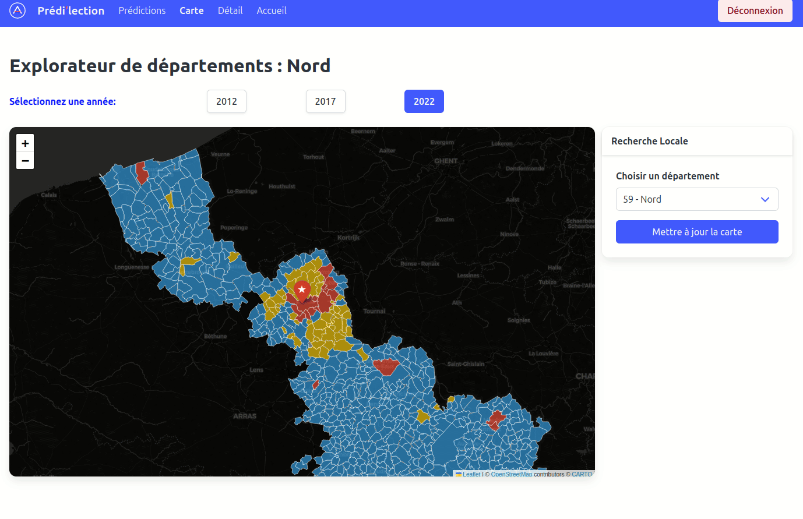

# Political Prediction

## 📋 Introduction

Predil'ection est une **Application web** conçue pour prédire les résultats des élections d'une commune ainsi que de consulter les données associées. Développée dans le cadre d'une formation en Data IA, cette Application possède des validations robustes et une couverture de tests.

**Objectif :** Fournir une interface intuitive pour les utilisateurs afin de consulter les prédictions électorales basées sur des données historiques et des modèles de machine learning.

---

## 🎯 Description

**Notre application** est une application web permettant de :

- ✅ Prédire les résultats électoraux d'une commune
- ✅ Afficher les données historiques des élections
- ✅ Fournir une interface utilisateur intuitive et responsive grâce à une carte interactive
- ✅ Authentifier les utilisateurs de manière sécurisée

### Fonctionnalités principales

|          Fonctionnalité          |                      Description                      |
| :--------------------------------: | :---------------------------------------------------: |
|     **Authentification**     |            Connexion sécurisée avec Django            |
| **Affichage des données**    | Affichage des données historiques des élections       |
|  **Gestion des utilisateurs**  |           CRUD complet pour les Utilisateurs           |
|   **Modèle de prédiction**   |   Modèle de classification pour les prédictions   |
|  **Validation de données**  |   DTOs et validation robuste de toutes les entrées   |
|   **Gestion des erreurs**   |   Codes d'erreur explicites et messages détaillés   |

---

## 🏗️ Architecture

### Sources de données
- **Données électorales** : Récupérées depuis des sources officielles telles que data.gouv.fr.
- **Données démographiques** : Intégration de données démographiques (INSEE) pour améliorer les prédictions.
- **Données géographiques** : Utilisation de données géographiques pour la visualisation sur la carte interactive.

### Stack technique

- **Frontend :** Django avec HTML, CSS (Bulma)
- **Backend :** FastAPI
- **Base de données :** SQLAlchemy ORM + PostgreSQL
- **Carte interactive** Framework CSS Folium pour la visualisation des données géographiques
- **Authentification :** Django Auth
- **Tests :** Pytest avec couverture de code
- **Documentation :** Swagger UI et ReDoc et commentaires détaillés dans le code

### Structure du projet

```
.
├── api
│   └── app
│       ├── core
│       ├── db
│       ├── endpoints
│       ├── model
│       ├── repositories
│       ├── routers
│       ├── schemas
│       ├── services
│       ├── tests
│       ├── utils
│       └── main.py
├── data
├── django_political_app
│   ├── core
│   ├── detail
│   ├── django_political_app
│   ├── map
│   ├── predictions
│   ├── static
│   ├── templates
│   ├── users
│   └── manage.py
├── docs
│   ├── Présentation
├── eda
├── maquette
├── ml
├── requirements.txt
└── README.md
```

## 🔧 Installation

### Prérequis

- **Python** 3.9 ou supérieur
- **PostgreSQL** 12 ou supérieur
- **pip** pour la gestion des dépendances

### Étapes d'installation

1. **Cloner le repository**

   ```bash
   git clone <url-du-repository>
   cd political-prediction
   ```
2. **Créer un environnement virtuel**

   ```bash
   python -m venv venv
   source venv/bin/activate    # Sur macOS/Linux
   # ou
   venv\Scripts\activate        # Sur Windows
   ```
3. **Installer les dépendances**

   ```bash
   pip install -r requirements.txt
   ```
4. **Configurer les variables d'environnement**

   Créez un fichier `.env` dans le dossier api et dans le dossier django_political_app avec les variables suivantes :
   
   django_political_app/.env :
   ```env
   SECRET_KEY='Ici la secret key de Django'
    DEBUG=false
    DATABASE_NAME=db.sqlite3
    BASE_URL_LOCAL="l'url de fast api"
    BASE_URL="https://geo.api.gouv.fr"
   ```
5. **Initialiser la base de données**

   ```bash
   # Appliquer les migrations Alembic
   alembic upgrade head
   ```
6. **Lancer l'application**
   fastapi :
   ```bash
   cd api
   uvicorn app.main:app --host 0.0.0.0 --port 8080 --reload
   ```
    django :
    ```bash
    cd django_political_app
    python manage.py collectstaticFévrier
    python manage.py runserver
    ```


L'Application sera accessible sur : `http://127.0.0.1:8000/home/`

---

## 📖 Documentation et tests

### Accéder à la documentation interactive

FastAPI génère automatiquement une documentation interactive :

- **Swagger UI** : [http://localhost:8000/docs](http://localhost:8000/docs)
- **ReDoc** : [http://localhost:8000/redoc](http://localhost:8000/redoc)

### Exécuter les tests

```bash
# Lancer tous les tests
pytest --cov=django_political_app --cov=api/app --cov-report=term-missing --ignore=api/test_db.py -v
```

---

## 👥 Auteurs

Ce projet a été développé par une équipe de trois développeurs :

- **Flora Trecul** - [Github](https://github.com/Flora-Trecul)
- **Ethan Puype** - [Github](https://github.com/NICHIKU)
- **Souhaïb Massrour** - [Github](https://github.com/GutsSama)
- **Alexandre Crestien** - [Github](https://github.com/AlexandreCrestien)

**Contexte :** Projet de formation Développeur Data IA - Simplon

---

## 📝 Licence

Ce projet est fourni à des fins éducatives.

---

**Dernière mise à jour :** 10 avril 2026
